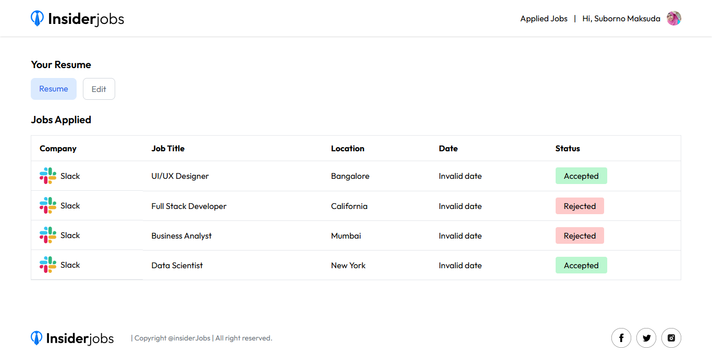

# 🏢 Insider Jobs

A full-featured **Job Portal Application** built with the **MERN stack** 🚀  
This platform connects **recruiters** and **job hunters** in one place, making the hiring process smoother and more transparent.

🔗 **Live Demo**: [Click Here](insider-jobs-client-phi.vercel.app)

---

## ✨ Features

### 👩‍💼 Recruiter Panel
- ➕ Publish new job circulars with details & requirements.
- 👀 Manage job visibility (show/hide circulars).
- 📑 View applicants’ profiles and resumes.
- ✅ Accept / ❌ Reject applications from the dashboard.

### 👨‍💻 Job Hunter Panel
- 📝 Apply for jobs with resume upload.
- 📋 Personal dashboard to track applied jobs.
- 🔔 See recruiter’s decision (accepted/rejected).
- 🔎 Filter jobs by **category** and **location**.

---

## 🛠️ Tech Stack

| Layer        | Technology |
|--------------|------------|
| **Frontend** | React, Tailwind CSS |
| **Backend**  | Node.js, Express.js |
| **Database** | MongoDB Atlas |
| **Auth**     | Clerk (for Job Hunter login) |
| **File Handling** | Cloudinary (resume & image uploads) |

---

## 📸 Screenshots

### Homepage


### Recruiter Dashboard
.png)

### Recruiter Dashboard
.png)

### Recruiter Dashboard
.png)

### Applicant View (Resume)


### Job Description View
![Job Description View] (./screenshots/job description view.png)

## ⚙️ Installation & Setup

Clone and run locally:

```bash
# Clone repo
git clone https://github.com/your-username/insider-jobs.git

# Go to folder
cd insider-jobs

# Install dependencies
npm install

# Add environment variables in `.env`

# Run development server
npm run dev
